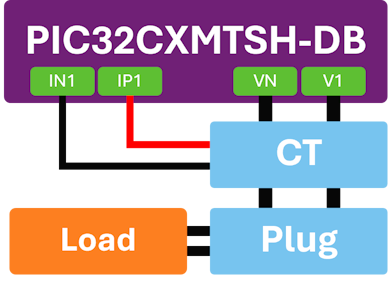
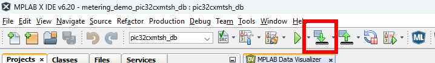
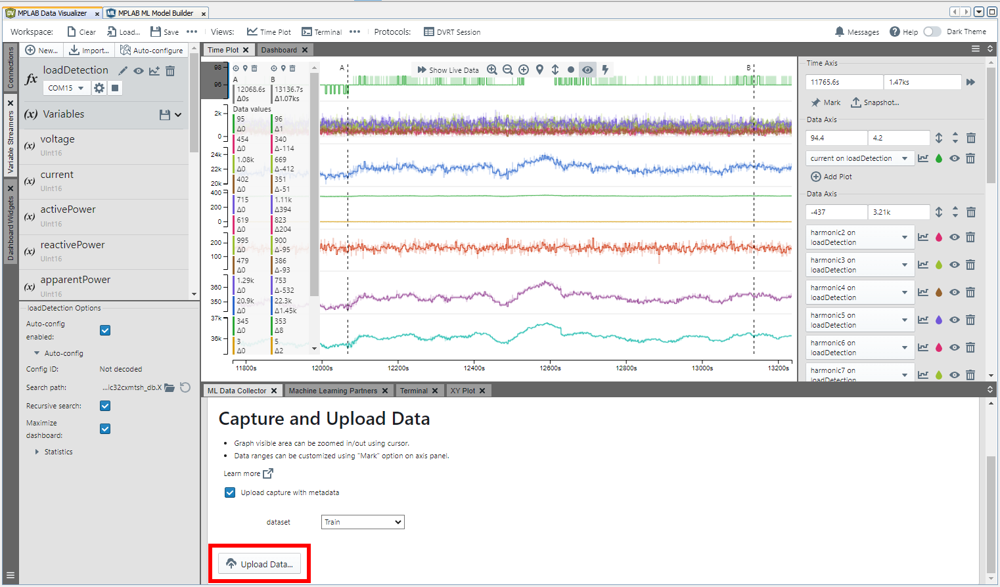
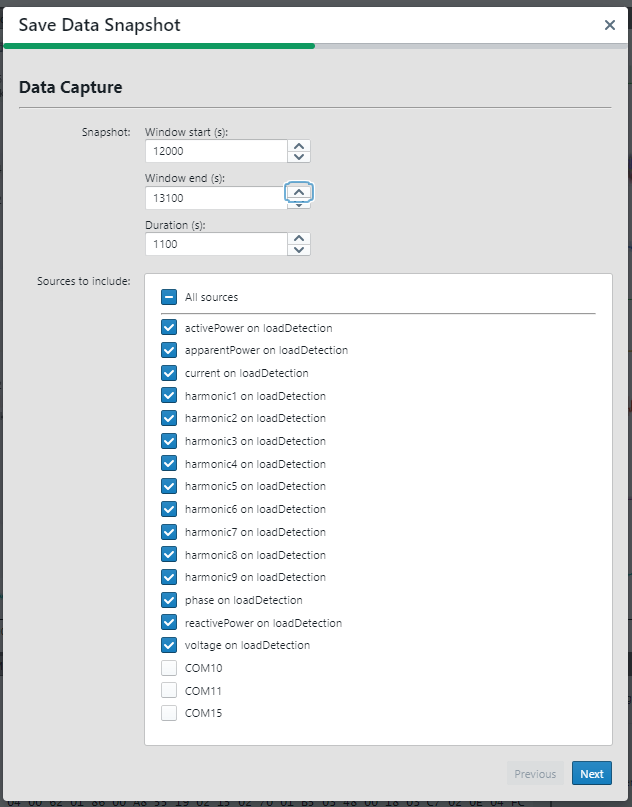
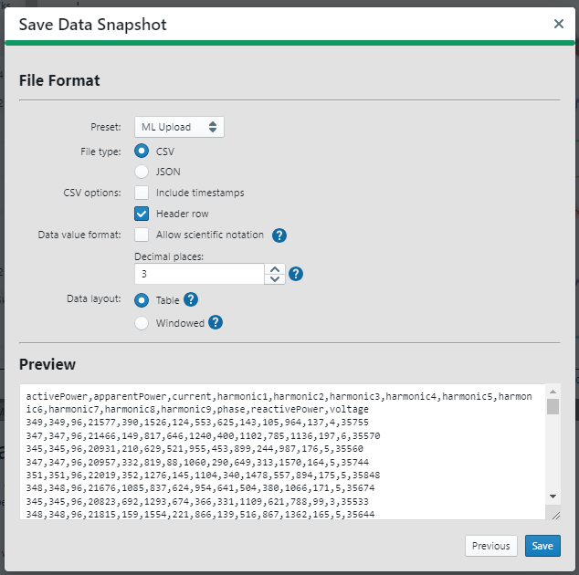

# PIC32CXMTx Load disaggregation example with ML

## ⚠ Disclaimer  

<b>
THE SOFTWARE ARE PROVIDED "AS IS" AND GIVE A PATH FOR SELF-SUPPORT AND SELF-MAINTENANCE. This repository contains example code intended to help accelerate client product development.  

For additional Microchip repos, see: <a href="https://github.com/Microchip-MPLAB-Harmony" target="_blank">https://github.com/Microchip-MPLAB-Harmony</a>

Checkout the <a href="https://microchipsupport.force.com/s/" target="_blank">Technical support portal</a> to access our knowledge base, community forums or submit support ticket requests.

</b>

## Repository Overview
This repository contains a firmware example which runs a machine learning model trained to distinguish between four different loads powered through  the PIC32CX32MTSH-DB kit using the different reads from the metrology library as input for a machine learning model.
 
|  |
| :--: |
| *Block diagram of the setup using PIC32CXMTSH-DB Evaluation Kit* |

|  |
| :--: |
| *Setup* |

## Hardware Used
* [EV84M21A - PIC32CXMTSH-DB Evaluation Kit](https://www.microchip.com/developmenttools/ProductDetails/EV84M21A)

|  |
| :--: |
| *EV84M21A - PIC32CXMTSH-DB Evaluation Kit* |

## Software Used
* MPLAB® X IDE (https://microchip.com/mplab/mplab-x-ide)
* MPLAB® XC32 compiler (https://microchip.com/mplab/compilers)
* MPLAB® Harmony 3 (https://www.microchip.com/harmony)
* MPLAB® Plugins
  * MPLAB® ML Model Builder
  * MPLAB® ML Data Collector

## Related Documentation
* [PIC32CX2051MTSH128](https://www.microchip.com/en-us/product/pic32cx2051mtsh128)
* [PIC32CXMTSH-DB Evaluation Kit](https://www.microchip.com/en-us/development-tool/EV84M21A)
* [MPLAB® Machine Learning Development Suite](https://www.microchip.com/en-us/tools-resources/develop/mplab-machine-learning-development-suite)

## How to Configure, Compile, and Flash

The steps below explain the process of configuring the the data logger firmware build, compiling it, and flashing it to the SAMD21 device.

1. Plug your PIC32CXMTSH-DB evaluation kit into your PC via USB.
2. Install the MPLAB X IDE and XC32 compiler. These are required to load the example project and to program the PIC32CXMTSH board.
3. Open the `firmware/metering_demo_pic32cxmtsh_db.X` project folder in MPLAB X.
4. Click the *Make and Program Device* button in the toolbar (see image below for reference).

   |  |
   | :--: |
   | *Make and Program Device* |

## Firmware Operation
The firmware example will run the Demo Meter Application [metering_demo](https://github.com/Microchip-MPLAB-Harmony/smartenergy_metrology/tree/master/apps/metering_demo/firmware) with two additional commands:

* LOADDATA - Sends continuously the metrology data to console using the stream format required by the MPLAB Data Visualizer plugin
  * The command will send the metrology info defined in the structure `SENSOR_DATA` of the function `_harmonicAnalysisCaptureLoadDataCallback()`
  * The captured data from the metrology library can be massaged in this function to use 16-bit format for the input parameters in the ML Model Builder

* LOADID - Runs the included ML model to identify the load connected to the board
  * The command will use the metrology info defined in the structure `SENSOR_DATA` of the function `_harmonicAnalysisLoadIdentificationCallback()` as input parameters of the ML model
  * The parameters required by the ML model and the structure of them can be consulted in theheader file `kb_typedef.h` of the knowledge pack

Enabling the directive `KB_DATA_TEST` modifies the function `_harmonicAnalysisLoadIdentificationCallback()` to get the data from the header file `testdata.h` instead of the metrology library. This header file provides valid data for ML knowledge pack to test the model.

## Configuring MPLAB Data Visualizer and Machine Learning Plugins
This project can be used to stream data to the [MPLAB Data Visualizer plugin](https://www.microchip.com/en-us/development-tools-tools-and-software/embedded-software-center/mplab-data-visualizer) by using the command LOADDATA. Once the firmware is running, follow the steps below to set up Data Visualizer.

1. Connect the PIC32CXMTSH-DB board to your computer, open up MPLAB X, and open the Data Visualizer plugin.

2. In the tab `Terminal`, select the Serial/CDC Connection that corresponds to the PIC32CXMTSH-DB board, adjust the baud rate to 115200, and click *Apply*, use play button to connect to the serial port and send serial command `LOADDATA` using the console 

3. Click the *Load Workspace* button as highlighted in the image below. Select the workspace file included in this repository, located under the `ld_dataframe` folder; you can always modify the configuration once it is loaded if needed.

4. Next, select the Serial/CDC Connection that corresponds to the PIC32CXMTSH-DB board, adjust the baud rate to 115200, and click *Apply*.

5. Use the play button on the Serial/CDC Connection to connect to the serial port. Once the connection is made, the PIC32CXMTSH will be available for use with the variable streamer.

6. Switch to the *Variable Streamers* tab and select the aforementioned Serial/CDC Connection from the drop down menu as the input data source for the variable streamer; this will enable parsing of the data stream. You may delete or add variables here if your sensor configuration differs from the pre-loaded ones. The data should now be available in the time plot. Double click anywhere within the time plot to start/stop scrolling of the time axis

Visit the [Machine Learning Plugin page](https://microchipdeveloper.com/machine-learning:ml-plugin) to learn more about using the Data Visualizer plugin to export your data for machine learning applications.

## Usage of the ML Data Collector Tab
This project can be used to generate streaming data to the MPLAB ML Model Builder plugin. Once the firmware is available in the time plot of the MPLAB Data Visualizer, follow the steps below to set up direct streaming.

1. In ML Data Collector, create a new project or select an existing one.

2. Add metadata in the selection tab if required. Once the desired data sources are plotted in the graph, select a region of interest in the data by focusing the Time Plot on that region. You can drag the plots in the time window to the desired region of data while scrolling to zoom in or out as needed. When you are satisfied with the data viewable in the Time Plot, click the Mark button to tag this region of data. Then, press button `Upload Data...` to save a data snapshot. 

   |  |
   | :--: |
   | *Data to capture ready* |

3. Select variables to upload, starting and finishing time of the data stream

   |  |
   | :--: |
   | *Selection of data* |

4. Check the file format and save the data snapshot. 

   |  |
   | :--: |
   | *Preview of the data snapshot* |

5. Select the local folder to store the snapshot. It will be automatically added to the project of the MPLAB ML Model Builder

## Usage of the ML Model Builder
Please follow the steps described in the document [*MPLAB Machine Learning Development Suite User's Guide*](https://onlinedocs.microchip.com/oxy/GUID-80D4088D-19D0-41E9-BE8D-7AE3BE021BBF-en-US-3/index.html) to generate a new ML model using the captured data

The new model generated by the ML Model Builder is called a Knowledge Pack, which contains the firmware code for detecting the loads in the application.

The knowledge pack includes the documentation to include it in your project.

The model included in the firmware example is able to detect until 4 different loads (lightbulb, fan, heater with 1 resistor and heater with 2 resistors) and the state when no load is connected
